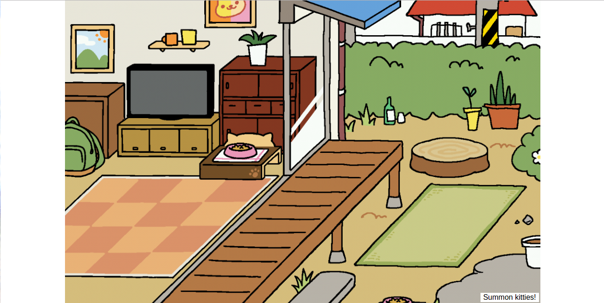
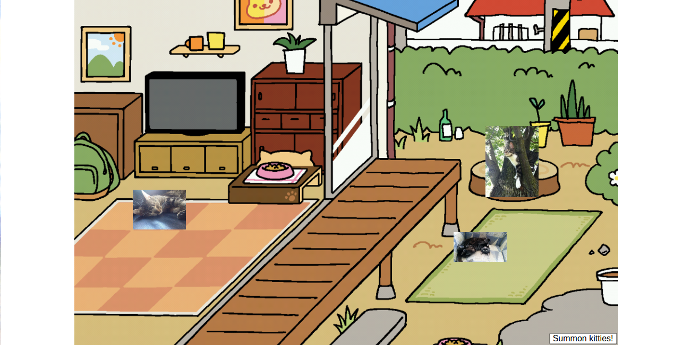

# BitKitten Yard
Today we are going to be building a simple variation on [Neko Atsume, a popular and adorable cat collecting game](https://en.wikipedia.org/wiki/Neko_Atsume).  

Start by forking and cloning this repository. It contains an HTML page with an empty yard for the cats to hang out in.  You should see something like this when you open `index.html` in your browser.




Our goal is to make the "summon kitties" button work to populate the yard with a selection of cats, like so:



We have set up a server at `http://bitkittens.herokuapp.com` that responds with random cats selected from a database of cats from the Bitmaker community.  You will be writing AJAX code to request JSON cat objects from the server, using JavaScript to make `` tags out of that data, and adding those images to the empty `.cat-box` divs that already exist on the page.

## Setting up the event handler
Your first step should be to set up a click event handler for the "summon kitties" button (use the developer tools or look at the HTML source code to determine the best way to select this element with jQuery).

Add a `console.log` statement to the callback function in order to verify that your code works so far before moving on to the next step.

## Making the AJAX request
Instead of just logging a message to the console, we want the button to trigger an AJAX request to the BitKitten server.  In `cats.js`, use `$.ajax` to make a `GET` request to `http://bitkittens.herokuapp.com/cats.json` asking for a JSON response.  

Test out the button in the browser and use the network tab of the developer tools to see what the response looks like.  The format should look something like this:

```json
{"cats": [{"id":44,"name":"Lanta","photo":"https://s3.amazonaws.com/bitmakerhq/resources/web-development/bitkittens/lanta.jpg","fun_fact":"Likes to pretend she is a cat","created_at":"2016-06-30T20:11:32.647Z","updated_at":"2016-06-30T20:11:32.647Z"},{"id":41,"name":"Timone","photo":"https://s3.amazonaws.com/bitmakerhq/resources/web-development/bitkittens/timone.jpg","fun_fact":"He likes to dress fancy","created_at":"2016-06-30T20:11:32.559Z","updated_at":"2016-06-30T20:11:32.559Z"},{"id":47,"name":"Sahara","photo":"https://s3.amazonaws.com/bitmakerhq/resources/web-development/bitkittens/sahara.jpg","fun_fact":"likes laser pointers and is a nap enthusiast","created_at":"2016-06-30T20:11:32.775Z","updated_at":"2016-06-30T20:11:32.775Z"}]}
```

The response data you get back from the server is a blob of JSON containing an array of cat objects.  JQuery will convert this blob into an object on your behalf, and then you can access values similarly to how you would access values from a Ruby hash.  For example, given the following JSON data:

```json
var dogJSON = {"puppies": [{"name": "Charlie", "owner": "Ella"}, {"name": "Abbey", "owner": "Dima"} ]};
```

the following code would return the array of dog objects:

```js
var dogList = dogJSON["puppies"];
```

Each element in that array is its own object, so the code to get the name of the first dog would look like:

```js
dogList[0]["name"] // returns "Charlie"
```

## Adding cats to the DOM
Chain a `done` callback on to your `$.ajax` function that does the following for each of the cats in the response data:

1. Creates a new `` tag
2. Sets the `src` attribute of the `` to the cat's photo
3. Sets the `alt` attribute of the `` to "Photo of (insert cat name here)"
4. Inserts that `` into one of the empty `.cat-box` divs

Hint: try getting this working for just one cat at first and then expand on your code to make it work for all three cats once you're confident in your solution.

Once you've completed this step you should see different cats appear every time you click the button.

## Kitties!!!

You're done!  Isn't it adorable?

## Stretch Exercises

1. By default the server responds with three random cats, but you can pass a "number" parameter in your AJAX call in order to control how many cats you receive.  Try asking for more cats and create additional `.cat-box` divs in your HTML to put them in.

2. Create a "cat book" that keeps track of which cats have visited your yard.  Add a `<ul>` somewhere on your page and every time the "summon kitties" button is clicked append new `<li>`s containing the names of the new cats.  How can you make sure the list contains no duplicates?  What if you want to also display the number of times each cat has visited?

3. Experiment with using [the jQuery animate() function](https://api.jquery.com/animate/) to make the cats move around your yard.
